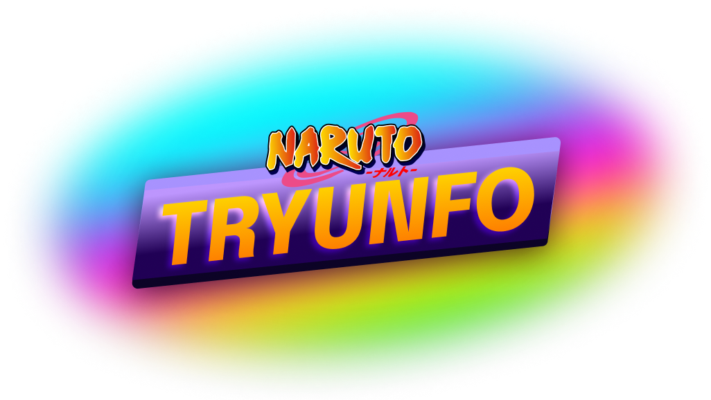

# Naruto Tryunfo

Naruto Tryunfo foi um projeto desenvolvido no começo de 2023, enquanto eu estudava na Trybe. Resolvi melhorá-lo com os conhecimentos que adquiri ao longo desses meses de estudo. É um game inspirado no jogo Trunfo, onde temos um baralho de cartas com personagens e atributos, e comparamos os atributos de duas cartas, dando a vitória para a carta com o atributo escolhido maior.

## Regras

Criação das Cartas:

- Nome da carta pode conter até 20 caracteres
- Só pode haver uma cartão super trunfo no baralho
- Cada atributo pode ter o valor máximo de 100
- A soma dos atributos não pode ultrapassar o valor de 300
- É preciso colocar um link válido com uma imagem

Jogando:

- O player escolhe o atributo clicando nele
- Quem vence a rodada garante um win
- Cada rodada vencida garante 100 pontos
- Ao final quem tiver mais win vence a partida
- Na tela final pode colocar o nickname e salvar sua pontuação no rank

## Stack utilizada

**Front-end:** React, CSS, Javascript, Vite

## Demonstração

Link:

## Documentação de cores

| Cor               | Hexadecimal                                                |
| ----------------- | ---------------------------------------------------------------- |
| Cor primária      |  #ffa500 |
| Cor secundária       |  #a52a2a |
| Cor aux.       |  #ffffff |
| Cor aux. 2       |  #800080 |
| Cor aux. 3       |  #008000 |

