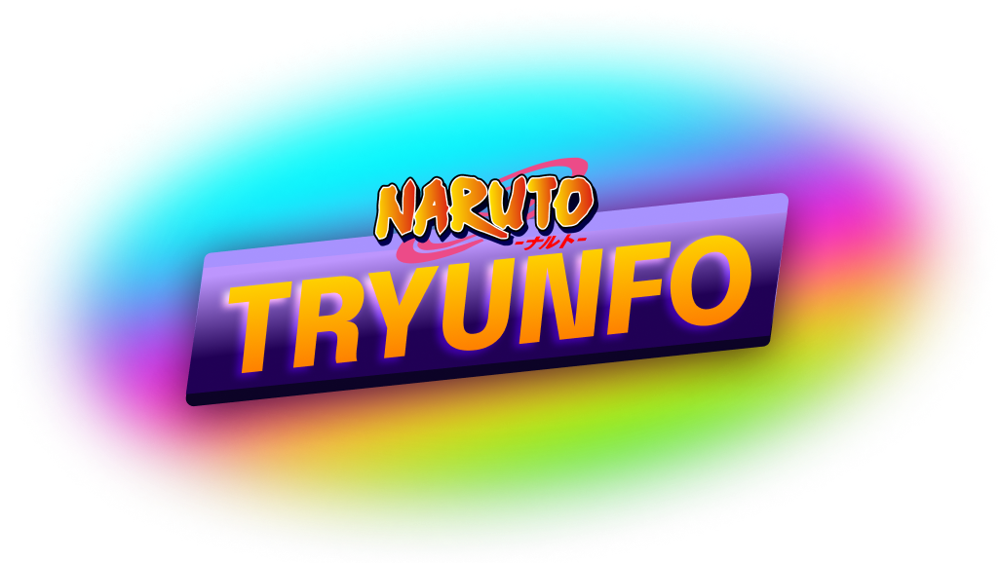

# 🍥 Naruto Tryunfo


> Uma aplicação interativa estilo "Super Trunfo" onde você cria e gerencia seu próprio baralho ninja!

[](https://naruto-tryunfo-bice.vercel.app/)

## 🍃 Sobre o Projeto

O **Naruto Tryunfo** é uma aplicação Single Page Application (SPA) desenvolvida em **React**. O projeto permite que o usuário crie cartas personalizadas com atributos de força, habilidade e jutsu, visualizando a renderização em tempo real.

O foco principal foi a manipulação de estados complexos e validação de formulários seguindo regras de negócio estritas.

## 📜 Regras do Jogo & Validações

Para que uma carta seja criada e salva no baralho, o código implementa as seguintes lógicas de validação (Regras de Negócio):

1.  **Limites de Atributos:** A soma dos três atributos (Ataque, Defesa, Chakra) não pode ultrapassar **210 pontos**.
2.  **Limite Individual:** Nenhum atributo pode ser maior que **90** ou menor que **0**.
3.  **Campos Obrigatórios:** Nome, Descrição, Imagem e Atributos devem estar preenchidos.
4.  **Carta Super Trunfo:** Só pode existir **uma** carta "Super Trunfo" por baralho. O checkbox dessa opção desaparece automaticamente se já houver uma salva.

## 🎨 Design System

A identidade visual foi inspirada no universo do anime Naruto, utilizando uma paleta de cores vibrante e contrastante.

| Cor | Hex | Uso Principal |
| :--- | :--- | :--- |
| 🟧 **Laranja Naruto** | `#F27405` | Destaques, Botões e Bordas |
| ⚫ **Preto Ninja** | `#1A1A1A` | Backgrounds e Textos Principais |
| ⚪ **Branco Pergaminho** | `#F5F5F5` | Fundo das Cartas e Textos em fundo escuro |
| 🔵 **Azul Chakra** | `#00A1D6` | Detalhes secundários e inputs |

## ⚡ Funcionalidades

- 📝 **Criação de Cartas:** Formulário com validação em tempo real (o botão de salvar só habilita se as regras forem cumpridas).
- 👁️ **Preview Dinâmico:** A carta é renderizada ao lado do formulário enquanto você digita.
- 🃏 **Baralho Ninja:** Listagem de todas as cartas salvas.
- 🔍 **Filtros Avançados:**
  - Busca por nome.
  - Filtro por raridade (Normal, Raro, Muito Raro).
  - Filtro exclusivo para Super Trunfo.
- ❌ **Gestão de Baralho:** Funcionalidade de excluir cartas indesejadas.

## 🛠️ Tecnologias Utilizadas

- **[React.js](https://reactjs.org/)** - Construção da interface e lógica de componentes.
- **CSS3 / CSS Modules** - Estilização modular.
- **JavaScript (ES6+)** - Lógica de validação e manipulação de arrays.
- **Git & GitHub** - Versionamento.
- 

## 📂 Como Rodar o Projeto

```bash
# 1. Clone o repositório
git clone [https://github.com/RiqueBruno/NarutoTryunfo.git](https://github.com/RiqueBruno/NarutoTryunfo.git)

# 2. Entre na pasta
cd NarutoTryunfo

# 3. Instale as dependências
npm install

# 4. Inicie a aplicação
npm start
